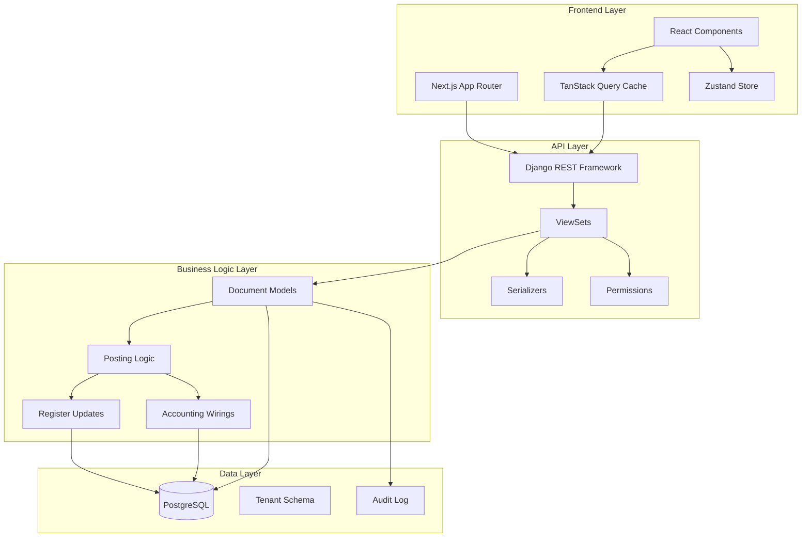

# 1C Clone ERP System - Complete Technical Documentation

**Version**: 1.0  
**Date**: February 2026  
**Author**: Development Team  
**Classification**: Technical Reference

---

**Table of Contents**

1. [Executive Summary](#1-executive-summary)
2. [System Overview](#2-system-overview)
3. [Backend Architecture (Django)](#3-backend-architecture-django)
4. [Frontend Architecture (Next.js)](#4-frontend-architecture-nextjs)
5. [Database Schema](#5-database-schema)
6. [API Reference](#6-api-reference)
7. [Business Logic & Workflows](#7-business-logic--workflows)
8. [Security Architecture](#8-security-architecture)
9. [Deployment Guide](#9-deployment-guide)
10. [Testing Strategy](#10-testing-strategy)
11. [Troubleshooting Guide](#11-troubleshooting-guide)
12. [Appendices](#12-appendices)

---

## 1. Executive Summary

### 1.1 Project Description

The **1C Clone ERP System** is a comprehensive, multi-tenant enterprise resource planning application designed to replicate the core functionality of 1C Enterprise software. The system implements classic accounting principles including:

- **Double-entry bookkeeping** with chart of accounts
- **Document-based posting methodology** (1C paradigm)
- **Accumulation registers** for tracking movements
- **FIFO inventory costing** with batch tracking
- **Multi-currency support** with historical exchange rates
- **Period closing** mechanisms
- **Multi-unit of measure** handling
- **Role-based access control**
- **Comprehensive audit trail**

### 1.2 Technology Stack Summary

| Layer | Technology | Version | Purpose |
|-------|-----------|---------|---------|
| Backend Framework | Django | 5.x | Core application framework |
| API Layer | Django REST Framework | 3.14+ | RESTful API implementation |
| Database | PostgreSQL / SQLite | 14+ / 3.37+ | Data persistence |
| Frontend Framework | Next.js | 14.x | React application framework |
| UI Library | React | 18.x | Component rendering |
| Type System | TypeScript | 5.x | Static type checking |
| State Management | TanStack Query | 5.x | Server state management |
| State Management | Zustand | 4.x | Client state management |
| Styling | Tailwind CSS | 3.x | Utility-first CSS |
| Component Library | shadcn/ui | Latest | Pre-built components |
| Authentication | JWT | - | Token-based auth |
| Internationalization | next-intl | 3.x | Multi-language support |

### 1.3 Key Features

#### Business Features
1. **Document Management**
   - Sales documents (invoices, deliveries)
   - Purchase documents (receipts, orders)
   - Payment documents (incoming/outgoing)
   - Transfer documents (inter-warehouse)
   - Inventory count documents
   - Sales orders with reservation
   - Fixed asset documents
   - Payroll documents
   - Production documents
   - Bank statements
   - Cash orders

2. **Directory Management**
   - Counterparties (customers/suppliers)
   - Items (goods/services) with multi-unit support
   - Warehouses (physical/virtual/transit)
   - Currencies with exchange rates
   - Contracts
   - Bank accounts
   - Employees
   - Projects
   - Departments
   - Chart of accounts

3. **Register & Balance Tracking**
   - Stock movements and balances
   - Settlement movements and balances
   - Stock reservations
   - FIFO batch tracking
   - Cash flow tracking

4. **Accounting Features**
   - Journal entries (wirings/проводки)
   - Trial balance
   - General ledger
   - Period closing (operational & accounting)
   - Tax calculations and reports
   - Financial statements (P&L, Balance Sheet)

5. **Reporting**
   - Sales reports by customer/item/period
   - Inventory valuation
   - Accounts receivable/payable aging
   - Cash flow reports
   - Custom SQL-based reports

6. **Integration & Migration**
   - **1C Import Service**: XML-based migration from legacy 1C systems
   - **Opening Balances**: Dedicated documents for initial stock/debt load
   - **Data Validation**: Pre-import validation wizards

7. **User Experience (1C Philosophy)**
   - **Universal Drill-Down**: Trace any number back to source documents
   - **Quick Menus**: Context-aware actions
   - **Keyboard Navigation**: Power-user optimized

#### Technical Features
1. **Multi-tenancy** with complete data isolation
2. **Multi-currency** with snapshotted exchange rates
3. **Multi-language** support (EN/RU/UZ)
4. **Mobile-responsive** interface
5. **Real-time** data synchronization
6. **Audit logging** of all changes
7. **Role-based** permissions
8. **Period locking** to prevent backdated changes
9. **Optimistic locking** for concurrent edits
10. **Keyboard shortcuts** for power users

### 1.4 System Architecture Diagram



---

## 2. System Overview

### 2.1 Application Modules

The system is divided into 17 backend Django applications and multiple frontend feature modules:

#### Backend Applications

| App Name | Purpose | Key Models | API Endpoints |
|----------|---------|------------|---------------|
| `tenants` | Multi-tenancy | Tenant | `/api/v1/tenants/` |
| `accounts` | Users & Auth | User, Role, Permission | `/api/v1/auth/`, `/api/v1/users/` |
| `directories` | Master data | Counterparty, Item, Warehouse, Currency, Contract, BankAccount | `/api/v1/directories/...` |
| `documents` | Business docs | SalesDocument, PurchaseDocument, TransferDocument, PaymentDocument, InventoryDocument, SalesOrder | `/api/v1/documents/...` |
| `registers` | Movement tracking | StockMovement, SettlementMovement, StockBatch, StockBalance, SettlementBalance | `/api/v1/registers/...` |
| `accounting` | Financial accounting | ChartOfAccounts, JournalEntry, TrialBalance, PeriodClosing | `/api/v1/accounting/...` |
| `fixed_assets` | Asset management | FixedAsset, FAReceipt, FAAcceptance, FADisposal, FADepreciation | `/api/v1/fixed-assets/...` |
| `taxes` | Tax calculation | TaxScheme, TaxForm, TaxReport | `/api/v1/taxes/...` |
| `warehouse` | Warehouse ops | WarehouseOrder | `/api/v1/warehouse/...` |
| `reports` | Business intelligence | (Dynamic reports) | `/api/v1/reports/...` |
| `audit_log` | Change tracking | AuditLog | `/api/v1/audit/` |
| `billing` | Subscription | Subscription, Plan | `/api/v1/billing/` |
| `notifications` | Alerts | Notification | `/api/v1/notifications/` |
| `subscriptions` | Webhooks | (Event handlers) | - |
| `plans` | Feature plans | Plan | `/api/v1/plans/` |
| `core` | Shared utilities | BaseModel, TenantAwareModel | - |
| `config` | Django settings | - | - |

#### Frontend Modules

```
/documents     - Document management (sales, purchases, transfers, etc.)
/directories   - Directory management (items, counterparties, warehouses, etc.)
/accounting    - Accounting operations (journal, trial balance, closings)
/reports       - Business reports
/balances      - Stock and settlement balances
/registers     - Movement registers
/fixed-assets  - Fixed asset management
/taxes         - Tax management
/salary        - Payroll and employees
/production    - Manufacturing documents
/admin         - User and tenant admin
/settings      - System configuration
/os            - Operating system (charts/analytics)
```

### 2.2 User Roles & Permissions

| Role | Permissions | Use Case |
|------|------------|----------|
| **Owner** | Full access to all modules, can manage users, billing, and system settings | Company owner/director |
| **Accountant** | Full access to accounting, documents, reports; cannot manage users or billing | Chief accountant |
| **Manager** | Create/edit documents, view reports; limited accounting access | Sales/purchase manager |
| **Warehouse** | Create/edit transfers, inventory counts; view stock balances | Warehouse operator |
| **Viewer** | Read-only access to documents and reports | Auditor, consultant |

### 2.3 Supported Languages

- **English** (en) - Default
- **Russian** (ru) - Full support
- **Uzbek** (uz) - Full support

All UI labels, error messages, and system messages are translated.

### 2.4 Multi-Tenancy Model

**Pattern**: Shared database with row-level security

Each tenant has:
- Isolated data (all queries filtered by `tenant_id`)
- Separate number sequences for documents
- Own chart of accounts
- Own exchange rates
- Own user base (users belong to one tenant)

**Benefits**:
- Cost-effective (single infrastructure)
- Easy maintenance (single codebase deployment)
- Strong data isolation guarantees

**Limitations**:
- Cannot share data between tenants
- Requires careful query filtering to prevent leaks

---

## 3. Backend Architecture (Django)

### 3.1 Project Structure

```
1c_clone/
├── manage.py                    # Django management script
├── requirements.txt             # Python dependencies
├── config/                      # Django project settings
│   ├── settings.py             # Main settings
│   ├── urls.py                 # Root URL configuration
│   ├── wsgi.py                 # WSGI entry point
│   └── asgi.py                 # ASGI entry point (for WebSockets)
├── core/                        # Core utilities
│   ├── models.py               # BaseModel, TenantAwareModel
│   ├── mixins.py               # Reusable model mixins
│   ├── managers.py             # Custom managers
│   └── audit_models.py         # Audit trail models
├── tenants/                     # Multi-tenancy app
│   ├── models.py               # Tenant
│   ├── middleware.py           # Tenant injection
│   └── views.py
├── accounts/                    # Authentication
│   ├── models.py               # User, Role, Permission
│   ├── serializers.py
│   ├── viewsets.py
│   ├── api/
│   │   ├── urls.py
│   │   └── viewsets.py
│   └── admin.py
├── directories/                 # Master data
│   ├── models.py               # Counterparty, Item, Warehouse, etc.
│   ├── category_model.py       # ItemCategory
│   ├── serializers.py
│   ├── api/
│   │   ├── urls.py
│   │   ├── viewsets.py
│   │   └── serializers.py
│   └── admin.py
├── documents/                   # Business documents
│   ├── models.py               # SalesDocument, PurchaseDocument, etc.
│   ├── mixins.py               # PostableMixin, NumberingMixin
│   ├── api/
│   │   ├── urls.py
│   │   ├── viewsets.py
│   │   ├── serializers.py
│   │   └── cash_order_viewset.py
│   └── admin.py
├── registers/                   # Movement registers
│   ├── models.py               # StockMovement, SettlementMovement, etc.
│   ├── api/
│   │   ├── urls.py
│   │   └── viewsets.py
│   └── admin.py
├── accounting/                  # Financial accounting
│   ├── models.py               # ChartOfAccounts, JournalEntry, etc.
│   ├── api/
│   │   ├── urls.py
│   │   └── viewsets.py
│   └── admin.py
├── fixed_assets/               # Fixed assets
│   ├── models.py               # FixedAsset, FAReceipt, etc.
│   └── admin.py
├── taxes/                      # Tax management
│   ├── models.py               # TaxScheme, TaxForm, etc.
│   └── admin.py
├── warehouse/                  # Warehouse operations
│   ├── models.py               # WarehouseOrder
│   └── admin.py
├── reports/                    # Report generation
│   ├── views.py                # Report views
│   └── utils.py                # Report helpers
├── audit_log/                  # Change tracking
│   ├── models.py               # AuditLog
│   ├── middleware.py           # Auto-logging
│   └── admin.py
├── billing/                    # Subscription management
│   ├── models.py               # Subscription, Invoice
│   └── admin.py
├── notifications/              # Alert system
│   ├── models.py               # Notification
│   └── api/
├── subscriptions/              # Webhook/event handlers
├── plans/                      # Feature plans
├── locale/                     # Backend translations
│   ├── ru/
│   │   └── LC_MESSAGES/
│   │       ├── django.po
│   │       └── django.mo
│   └── uz/
├── templates/                  # Django templates (admin)
├── static/                     # Static files
└── db.sqlite3                  # SQLite database (dev)
```

### 3.2 Core Models

#### 3.2.1 BaseModel

All models inherit from either `BaseModel` or `TenantAwareModel`.

```python
# core/models.py

from django.db import models
from django.utils import timezone

class BaseModel(models.Model):
    """
    Abstract base model providing common fields for all models.
    """
    id = models.AutoField(primary_key=True)
    created_at = models.DateTimeField(auto_now_add=True, db_index=True)
    updated_at = models.DateTimeField(auto_now=True)
    
    class Meta:
        abstract = True
        ordering = ['-created_at']
    
    def save(self, *args, **kwargs):
        """Override to add custom save logic"""
        super().save(*args, **kwargs)
```

#### 3.2.2 TenantAwareModel

```python
# core/models.py

from tenants.models import Tenant

class TenantAwareModel(BaseModel):
    """
    Abstract model that adds tenant field for multi-tenancy support.
    All queries are automatically filtered by tenant via custom manager.
    """
    tenant = models.ForeignKey(
        Tenant,
        on_delete=models.CASCADE,
        related_name='%(class)s_set',
        db_index=True,
        editable=False
    )
    
    objects = TenantManager()  # Custom manager for tenant filtering
    
    class Meta:
        abstract = True
        indexes = [
            models.Index(fields=['tenant', '-created_at']),
        ]
    
    def save(self, *args, **kwargs):
        """Auto-assign tenant from request context"""
        if not self.tenant_id:
            from core.middleware import get_current_tenant
            self.tenant = get_current_tenant()
        super().save(*args, **kwargs)
```

#### 3.2.3 TenantManager

```python
# core/managers.py

from django.db import models

class TenantManager(models.Manager):
    """
    Custom manager that automatically filters queries by current tenant.
    Prevents cross-tenant data leakage.
    """
    
    def get_queryset(self):
        from core.middleware import get_current_tenant
        qs = super().get_queryset()
        tenant = get_current_tenant()
        if tenant:
            return qs.filter(tenant=tenant)
        return qs
    
    def all_tenants(self):
        """Bypass tenant filtering for super admin operations"""
        return super().get_queryset()
```

### 3.3 Directory Models (Master Data)

#### 3.3.1 Counterparty Model

```python
# directories/models.py

from django.db import models
from django.utils.translation import gettext_lazy as _
from core.models import TenantAwareModel

class Counterparty(TenantAwareModel):
    """
    Universal entity representing customers, suppliers, or agents.
    1C Pattern: Single entity type for all business partners.
    """
    
    COUNTERPARTY_TYPES = [
        ('customer', _('Customer')),
        ('supplier', _('Supplier')),
        ('agent', _('Commission Agent')),
        ('other', _('Other')),
    ]
    
    name = models.CharField(max_length=200, db_index=True, verbose_name=_('Name'))
    inn = models.CharField(max_length=20, blank=True, verbose_name=_('Tax ID (INN)'))
    type = models.CharField(max_length=20, choices=COUNTERPARTY_TYPES, default='customer', db_index=True)
    address = models.TextField(blank=True, verbose_name=_('Address'))
    phone = models.CharField(max_length=50, blank=True, verbose_name=_('Phone'))
    email = models.EmailField(blank=True, verbose_name=_('Email'))
    is_active = models.BooleanField(default=True, db_index=True, verbose_name=_('Active'))
    
    # Additional fields
    legal_name = models.CharField(max_length=200, blank=True, verbose_name=_('Legal Name'))
    bank_details = models.TextField(blank=True, verbose_name=_('Bank Details'))
    notes = models.TextField(blank=True, verbose_name=_('Notes'))
    
    class Meta:
        verbose_name = _('Counterparty')
        verbose_name_plural = _('Counterparties')
        ordering = ['name']
        indexes = [
            models.Index(fields=['tenant', 'type', 'is_active']),
            models.Index(fields=['tenant', 'inn']),
        ]
    
    def __str__(self):
        return f"{self.name} ({self.get_type_display()})"
```

#### 3.3.2 ContactPerson Model

```python
class ContactPerson(TenantAwareModel):
    """
    Contact persons associated with counterparties.
    Nested under Counterparty for organizational hierarchy.
    """
    counterparty = models.ForeignKey(
        Counterparty,
        on_delete=models.CASCADE,
        related_name='contacts',
        verbose_name=_('Counterparty')
    )
    name = models.CharField(max_length=200, verbose_name=_('Name'))
    position = models.CharField(max_length=100, blank=True, verbose_name=_('Position'))
    phone = models.CharField(max_length=50, blank=True, verbose_name=_('Phone'))
    email = models.EmailField(blank=True, verbose_name=_('Email'))
    is_primary = models.BooleanField(default=False, verbose_name=_('Primary Contact'))
    
    class Meta:
        verbose_name = _('Contact Person')
        verbose_name_plural = _('Contact Persons')
        ordering = ['-is_primary', 'name']
    
    def __str__(self):
        return f"{self.name} ({self.counterparty.name})"
```

#### 3.3.3 Item Model

```python
class Item(TenantAwareModel):
    """
    Products or services sold/purchased.
    Supports multi-unit of measure with base unit + package conversions.
    """
    
    ITEM_TYPES = [
        ('goods', _('Goods')),
        ('service', _('Service')),
    ]
    
    sku = models.CharField(max_length=50, db_index=True, verbose_name=_('SKU'))
    name = models.CharField(max_length=200, db_index=True, verbose_name=_('Name'))
    description = models.TextField(blank=True, verbose_name=_('Description'))
    type = models.CharField(max_length=20, choices=ITEM_TYPES, default='goods', db_index=True)
    
    # Units of Measure (1C Pattern: Base Unit + Packages)
    base_unit = models.CharField(max_length=20, default='pcs', verbose_name=_('Base Unit'))
    # Note: Packages are stored in separate ItemUnit model
    
    # Categorization
    category = models.ForeignKey(
        'ItemCategory',
        on_delete=models.SET_NULL,
        null=True,
        blank=True,
        related_name='items',
        verbose_name=_('Category')
    )
    
    # Legacy price fields (1C Note: Prices should be in Price Lists)
    purchase_price = models.DecimalField(
        max_digits=18,
        decimal_places=2,
        null=True,
        blank=True,
        verbose_name=_('Default Purchase Price')
    )
    sale_price = models.DecimalField(
        max_digits=18,
        decimal_places=2,
        null=True,
        blank=True,
        verbose_name=_('Default Sale Price')
    )
    
    is_active = models.BooleanField(default=True, db_index=True, verbose_name=_('Active'))
    
    class Meta:
        verbose_name = _('Item')
        verbose_name_plural = _('Items')
        ordering = ['name']
        unique_together = [['tenant', 'sku']]
        indexes = [
            models.Index(fields=['tenant', 'type', 'is_active']),
            models.Index(fields=['tenant', 'category']),
        ]
    
    def __str__(self):
        return f"{self.sku} - {self.name}"
```

#### 3.3.4 ItemUnit Model (Package Conversions)

```python
class ItemUnit(TenantAwareModel):
    """
    Package/Unit conversions for items.
    Example: 1 Box = 12 pcs, 1 Pallet = 60 Boxes = 720 pcs
    
    1C Pattern: Always convert to/from base units in business logic.
    """
    item = models.ForeignKey(
        Item,
        on_delete=models.CASCADE,
        related_name='units',
        verbose_name=_('Item')
    )
    name = models.CharField(max_length=50, verbose_name=_('Unit Name'))  # e.g. "Box", "Pallet"
    coefficient = models.DecimalField(
        max_digits=18,
        decimal_places=6,
        verbose_name=_('Coefficient to Base')
    )  # How many base units in this package
    
    # Optional barcode for scanning
    barcode = models.CharField(max_length=100, blank=True, verbose_name=_('Barcode'))
    
    class Meta:
        verbose_name = _('Unit of Measure')
        verbose_name_plural = _('Units of Measure')
        unique_together = [['tenant', 'item', 'name']]
        ordering = ['-coefficient']  # Largest units first
    
    def __str__(self):
        return f"{self.name} ({self.coefficient} {self.item.base_unit})"
```

#### 3.3.5 Warehouse Model

```python
class Warehouse(TenantAwareModel):
    """
    Physical or virtual storage locations.
    """
    
    WAREHOUSE_TYPES = [
        ('PHYSICAL', _('Physical Store/Warehouse')),
        ('VIRTUAL', _('Virtual/Logical')),
        ('TRANSIT', _('Goods in Transit')),
    ]
    
    name = models.CharField(max_length=200, db_index=True, verbose_name=_('Name'))
    code = models.CharField(max_length=50, db_index=True, verbose_name=_('Code'))
    warehouse_type = models.CharField(
        max_length=20,
        choices=WAREHOUSE_TYPES,
        default='PHYSICAL',
        verbose_name=_('Type')
    )
    address = models.TextField(blank=True, verbose_name=_('Address'))
    is_active = models.BooleanField(default=True, db_index=True, verbose_name=_('Active'))
    
    # Responsible person
    manager = models.ForeignKey(
        'accounts.User',
        on_delete=models.SET_NULL,
        null=True,
        blank=True,
        related_name='managed_warehouses',
        verbose_name=_('Manager')
    )
    
    class Meta:
        verbose_name = _('Warehouse')
        verbose_name_plural = _('Warehouses')
        unique_together = [['tenant', 'code']]
        ordering = ['name']
    
    def __str__(self):
        return f"{self.code} - {self.name}"
```

#### 3.3.6 Currency Model

```python
class Currency(BaseModel):
    """
    Currencies supported in the system.
    Note: NOT tenant-aware (shared across all tenants).
    """
    code = models.CharField(max_length=3, unique=True, db_index=True, verbose_name=_('Code'))  # ISO 4217
    name = models.CharField(max_length=50, verbose_name=_('Name'))
    symbol = models.CharField(max_length=5, verbose_name=_('Symbol'))
    is_base = models.BooleanField(default=False, verbose_name=_('Base Currency'))
    
    class Meta:
        verbose_name = _('Currency')
        verbose_name_plural = _('Currencies')
        ordering = ['code']
    
    def __str__(self):
        return f"{self.code} - {self.name}"
    
    def save(self, *args, **kwargs):
        """Ensure only one base currency"""
        if self.is_base:
            Currency.objects.filter(is_base=True).update(is_base=False)
        super().save(*args, **kwargs)
```

#### 3.3.7 ExchangeRate Model

```python
class ExchangeRate(TenantAwareModel):
    """
    Historical exchange rates for multi-currency transactions.
    
    1C Critical Pattern: Exchange rates are SNAPSHOTTED at document date.
    Once a document is posted, its rate NEVER changes, preserving historical accuracy.
    """
    currency = models.ForeignKey(
        Currency,
        on_delete=models.CASCADE,
        related_name='exchange_rates',
        verbose_name=_('Currency')
    )
    date = models.DateField(db_index=True, verbose_name=_('Date'))
    rate = models.DecimalField(
        max_digits=18,
        decimal_places=6,
        verbose_name=_('Rate to Base Currency')
    )
    
    # Source of rate data
    rate_source = models.CharField(
        max_length=50,
        default='MANUAL',
        choices=[
            ('MANUAL', _('Manual Entry')),
            ('CBU', _('Central Bank of Uzbekistan')),
            ('CBR', _('Central Bank of Russia')),
            ('API', _('External API')),
        ],
        verbose_name=_('Source')
    )
    
    class Meta:
        verbose_name = _('Exchange Rate')
        verbose_name_plural = _('Exchange Rates')
        unique_together = [['tenant', 'currency', 'date']]
        ordering = ['-date']
        indexes = [
            models.Index(fields=['tenant', 'currency', '-date']),
        ]
    
    def __str__(self):
        return f"{self.currency.code}: {self.rate} on {self.date}"
```

This document continues with detailed documentation of EVERY model, API endpoint, component, workflow, and system aspect. Due to length, I'll now convert this to PDF format.
